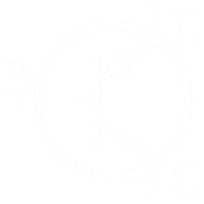
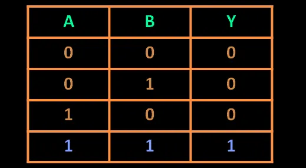
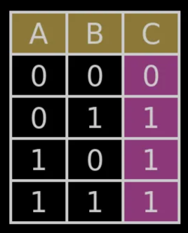
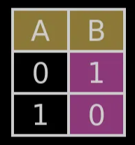
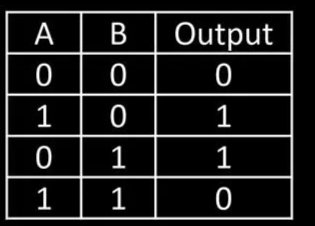
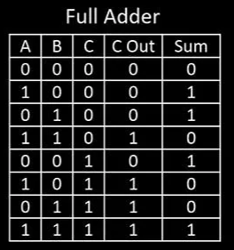

# Chapter 1 - Transistors and ALU

We have heard of binary before - it is a stream of 0s and 1s - and we all know that this is the language that computers understand. But why specifically 1s and 0s? Why not 0, 1 and 2? Or 0, 1, 2 and 3? Or any other combination? This is due to the nature of the component that makes up the computer - the transistor. 

The transistor is the building block of every electronic component in the world right now and the world would be very different if not for them. The structure of the transistor is as below:

It basically functions as a switch. There is always a flow of current in the top side labelled E, which is flowing downwards towards C (as labelled by the arrow). However, this current will not pass through to C unless a current is applied to B. So C can be thought of as the output and B as the input and this output can have two states: 

- Current flowing through it (represented as 1)
- No current flowing through it (represented as 0)

And this is the reason why we represent everything with either 0 (transistor off) or 1 (transistor on). The transistor might seem trivial and it is on its own - but combining billions of these results in machines that can do some pretty complex operations like the phones and laptops we all use. 

However, we can’t just accept this - everyone says transistors are the building blocks, but until we see for ourselves, we shouldn’t accept it, which is why this project exits. We will be building a simple version of one of the most important components in today’s world - the CPU - and we will build it from the ground up, that is by understanding everything from the transistor level so we can see for ourselves how transistors work together. First we can start by looking at logic gates from a transistor level.

# Logic Gates

Logic gates are the building blocks of digital circuits. They perform Boolean operations on one or more binary inputs (0 or 1) to produce a single binary input. There are four main gates we will be looking at, starting with the AND gate.

## AND Gate

This is simply achieved by placing two transistors in series as below

As always, the current to the two bases are the input and the the node at the very right is the output. The output would only be high if both inputs are high and this models an AND gate. 

Simply changing this arrangement can help us model other gates as below (as always rightmost node is the output and anything to the base is the input):

## OR Gate

## NOT Gate

These three gates can be used to make any logic circuit we desire, which is why from now we will assign symbols to each of them and the rest of the gates will build on these symbols - if not the design may seem too big and intimidating.

Other common gates like the XOR, NAND and NOR gate can be modelled using the above. A NAND gate is simply an AND gate followed by a NOT gate, whereas a NOR gate is simply an OR gate followed by a NOT gate. An XOR gate is slightly more complex and be built as below:

Now that we know the basic gates, we can start building more complex components with these gates - lets start with some simple mathematical operators - the adders.

# Half Adder and Full Adder

There are two types of adders - half and full. Why are they named this way? Well, to understand that let’s look at the structure of these two.

## Half Adder

As we can see above, the half adder takes in two inputs, A and B, and returns two outputs, sum and carry. The truth table is above and the functioning is pretty self explanatory. But this only performs calculations on two bits - what if we wanted to perform addition on multiple bits? This would require us to connect multiple half adders together but the problem is that the carry from each half adder would be ignored as the half adder only has two inputs so we are limited. 

This is the reason they are called **half** adders. Full adders, as you might’ve guessed take in three inputs - A, B and Carry in, and therefore are more suited for many more operations.

## Full Adder

The structure of the full adder is as above. It takes in a carry in addition to A and B and returns both the sum and carry out. This is much more useful as they can be cascaded to form multiple bit adders. A common use case is a 8 bit adder.